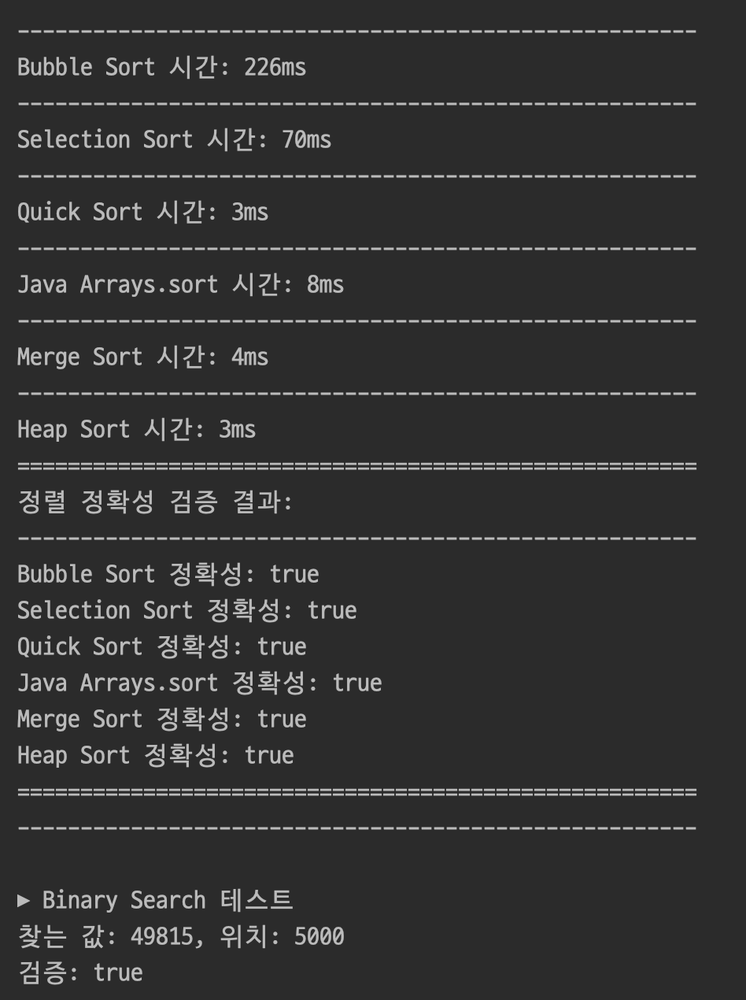

# Sorting functions

---

>
>정수 n개를 랜덤으로 생성하여 배열에 담아 두고
>현장에서 자주 사용되는 3가지 정렬알고리즘을 사용하는 함수들을 Util 클래스에 각각 만들어 사용하여
>
> 1. 출력하고자 한다.
> 2. 각 정렬함수의 성능을 비교 하고 싶다

---

✅ 목표
정수 n개를 랜덤으로 배열에 담는다.

Util 클래스에 다음 정렬 알고리즘을 함수로 구현한다:

- Bubble Sort 
- Selection Sort 
- Quick Sort
- Java Arrays.sort 
- Merge Sort 
- Heap Sort 

정렬된 결과를 출력한다.
각 알고리즘의 수행 시간을 측정하여 비교한다.

---
